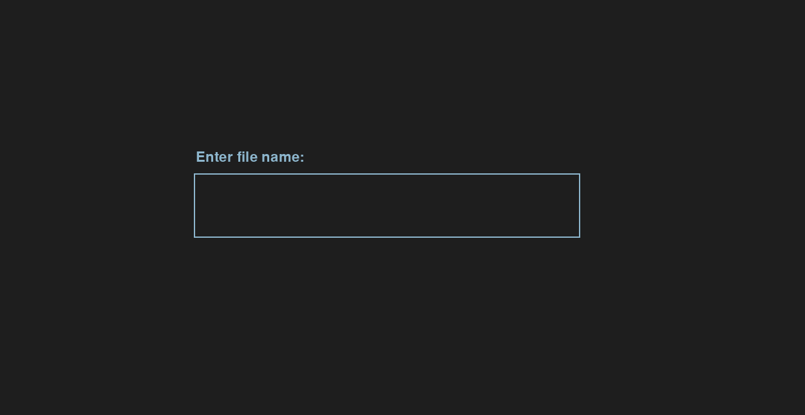

# A* Pathfinding-Algorithm

## Table of contents
* [General info](#general-info)
* [Technologies](#technologies)
* [Setup](#setup)
* [Additional info](#additional-info)

## General info
Implementation and visualisation of an A* pathfinding algorithm with weights both in 2d and 3d.

## Technologies
pygame - visualisation/maze creation in 2d. 
Minecraft - visualisation/maze creation in 3d. 
mcpi - acquiring minecraft data. (althought it's really slow on big scale, and I'm looking for something better) 
numpy - for faster maze_functions. 
pandas - for clear in-file quick visualisation and maze saving. 
pydirectinput - for bot movement in game (it's not 100% precise yet) 
multithreading socket stuffing algorithm writted mostly [Joseph Reynolds](https://github.com/joseph-reynolds) with my minor tweaks to work in python3.  

## Setup
If you want to play around with 2d version just get required libraries and start main.py script.
You'll be greeted with main menu where you can choose your actions:

If you want to connect with minecraft, play around with 3d version and also visualise final path (and maze) in game
you'll need to download mcpi server and connect to "localhost" in direct connect in Minecraft menu. ([quick tutorial on this](https://www.youtube.com/watch?v=N6fm11LFUvk&ab_channel=Codeboosh))

## Additional info
Pressing said keys will trigger event stated to the right of it, pressing "I" (importing exising maze) will take you
to a screen with prompt box that'll be highlighted green once you click it, in here you can write existing in saved_mazes
file name (without extention)

if you write name of 3d maze it will automatically start 3d pathfinding but it has no visualization for it in pygame, so just press enter
after some time to see path directions printed onto console or built in minecraft.  

Console output:

Where U is Up (in 3d space), D is Down (in 3d space), R is Righ, L is Left, F is front (it's like up when looking in 2d space) and B is back (it's like down when working in 2d space)

Drawing maze is done with keys shown in menu, you can choose between normal pathfinding and no-diagonal one (used to move around in minecraft) 
"big_maze" file with normal pathfinding: 

"big_maze" file with no_diagonals pathfinding: 

Finally, you can change square_size when creating your own mazes in settings file, as well as changing LIVE_VIEW option to True if you want
to see algorithm working live, looking for shortest path and updating all the nodes accordingly. 

PS. You can also change weights values and colors as you like.  

On the last note: 
2D version is working flawlessly, 3D pathfinding algorithm works great, but gathering data from Minecraft on a big scale is troubling, since it gives different values each time  
it is run with the same get_grid() function (it is most likely due to multithreading and mc server not keeping up). I might try to read into that in the future, but for now I'm leaving this working version as it is.